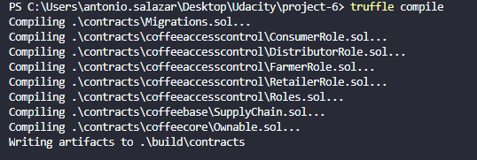
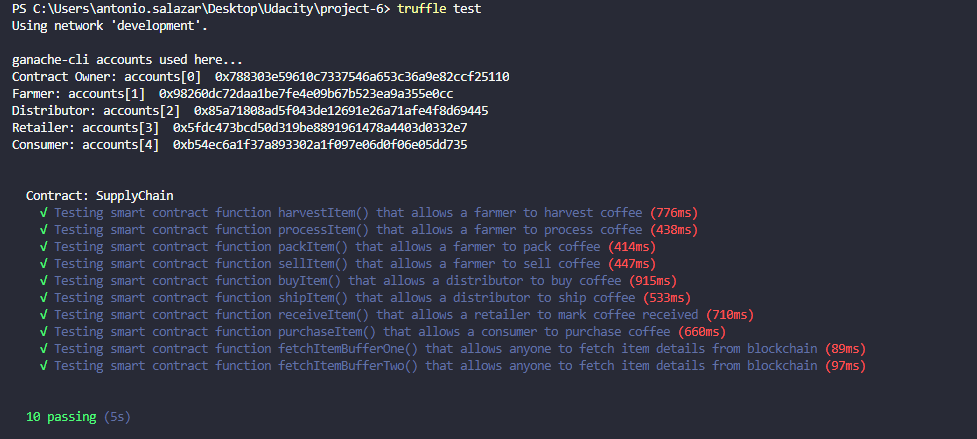
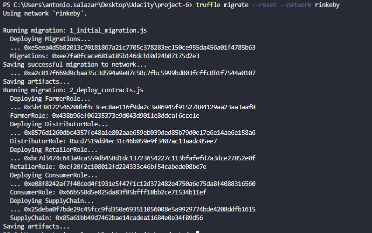

# Supply chain & data auditing

This repository containts an Ethereum DApp that demonstrates a Supply Chain flow between a Seller and Buyer. The user story is similar to any commonly used supply chain process. A Seller can add items to the inventory system stored in the blockchain. A Buyer can purchase such items from the inventory system. Additionally a Seller can mark an item as Shipped, and similarly a Buyer can mark an item as Received.

### Versions used for this project

```
Truffle v5.2.4 (core: 5.2.4)
Solidity - 0.4.24 (solc-js)
Node v12.0.0
Web3.js v1.2.9
```

### Contract Address:

- FarmerRole: 0xf8ed684cc7c460cd69bdfdb751b6c3ef50df2bbe

- RetailerRole: 0x72bcc2b89f30a4390fe3e61cabf36896ea19bf19

- ConsumerRole: 0xb2d1629c2aa923eeb3fce46e05be77eb9d2df1fc

- SupplyChain: 0x07cda40ba7b0b8c752cf5894dc221bd4b8e3220f

### The contracts have compiled successfully ✔️



All of the tests have passed ✔️



- The contracts have succesfully been deployed to Rinkeby network ✔️


